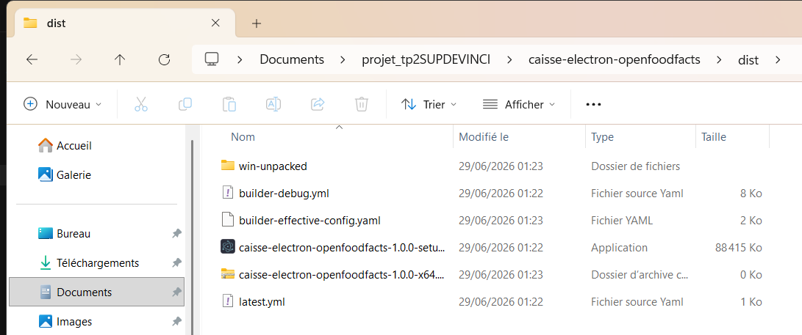
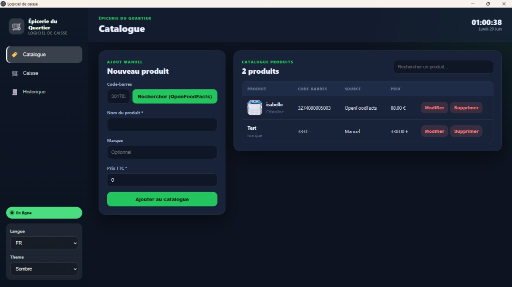
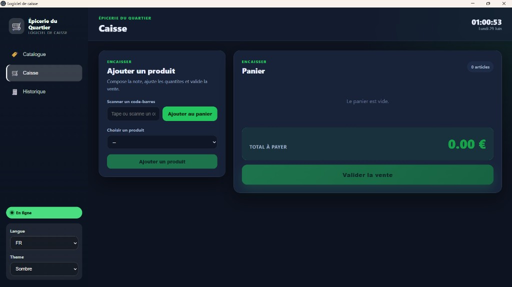
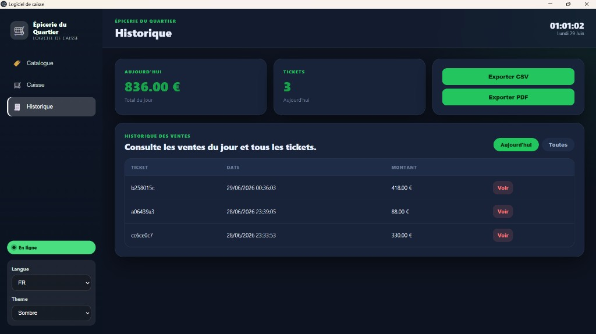

# Logiciel de caisse — Electron + OpenFoodFacts

Application **desktop Electron** pour une épicerie de quartier : gérer un catalogue de produits,
encaisser les clients, consulter l'historique des ventes et exporter les chiffres pour le comptable.

Projet réalisé dans le cadre du [projet final Electron](https://ic-etagsolutions.com/cours/electron/projet-final.html) — Master 2.

---

## Contexte

Une épicerie de quartier veut remplacer son cahier et sa vieille caisse par un logiciel installé
sur le PC de la boutique. L'application doit être **simple**, **fiable**, fonctionner **hors-ligne**
et s'installer **sans terminal** (un vrai installeur).

---

## Prérequis

- **Node.js** v20.19+ ou v22 LTS — [nodejs.org](https://nodejs.org)
- **npm** (inclus avec Node.js)
- **Git** (pour cloner le dépôt)
- **Windows** (pour générer l'installeur `.exe`)

Voir la section [Générer l'installeur Windows](#générer-linstalleur-windows-exe) pour les étapes complètes.

---

## Installation du projet (développement)

```bash
git clone https://github.com/AnasMahhou10/caisse-electron-openfoodfacts.git
cd caisse-electron-openfoodfacts
npm install
```

---

## Lancement en mode développement

```bash
npm run dev
```

Une fenêtre Electron s'ouvre avec l'interface du logiciel de caisse.

> **Attention :** `npm run dev` sert à **développer et tester**. Ce n'est **pas** une installation
> définitive sur le PC. Pour installer l'app comme un vrai logiciel (raccourci bureau, sans terminal),
> il faut générer l'installeur `.exe` (voir section suivante).

---

## Générer l'installeur Windows (`.exe`)

Le sujet demande un **vrai installeur** packagé avec `electron-builder`. Le fichier `.exe` n'est
**pas** dans le dépôt Git : chaque personne qui clone le projet doit le **générer localement**.

### Prérequis

- Un PC **Windows**
- **Node.js** v20.19+ ou v22 LTS — [nodejs.org](https://nodejs.org)
- Connexion internet (electron-builder télécharge Electron ~137 Mo la première fois)

### Étapes

```bash
# 1. Cloner et installer les dépendances (si pas déjà fait)
git clone https://github.com/AnasMahhou10/caisse-electron-openfoodfacts.git
cd caisse-electron-openfoodfacts
npm install

# 2. Générer l'installeur
npm run build:win
```

Cette commande fait automatiquement :

1. **Vérification TypeScript** (`typecheck`)
2. **Compilation** du code dans `out/` (main, preload, renderer)
3. **Packaging** avec electron-builder → création du `.exe` dans `dist/`

### Résultat

Le fichier généré se trouve ici :

```text
dist/caisse-electron-openfoodfacts-1.0.0-setup.exe
```



| Fichier / dossier | Rôle |
| ----------------- | ---- |
| `caisse-electron-openfoodfacts-1.0.0-setup.exe` | **Installeur** à double-cliquer |
| `win-unpacked/` | Version décompressée (test sans installer) |
| `latest.yml` | Métadonnées de version |

### Installer l'application sur le PC

1. **Double-clic** sur `dist/caisse-electron-openfoodfacts-1.0.0-setup.exe`
2. Si Windows affiche « Windows a protégé votre PC » → **Informations complémentaires** → **Exécuter quand même** (normal : l'installeur n'est pas signé numériquement)
3. L'app **« Logiciel de caisse »** s'installe et crée un **raccourci sur le bureau**
4. Lancer l'app depuis le bureau ou le menu Démarrer — **plus besoin de `npm run dev`**

### Récapitulatif : dev vs installeur

| | `npm run dev` | `npm run build:win` |
| --- | --- | --- |
| **Usage** | Développement / tests | Installation finale |
| **Besoin de Node.js** | Oui | Oui (uniquement pour builder) |
| **Terminal requis** | Oui, à chaque lancement | Non, après installation |
| **Raccourci bureau** | Non | Oui |
| **Fichier produit** | — | `dist/*.exe` |

### Autres plateformes

```bash
npm run build:mac    # macOS (.dmg)
npm run build:linux  # Linux (AppImage, deb)
```

---

### Utilisation rapide

| Onglet         | Action                                                                                   |
| -------------- | ---------------------------------------------------------------------------------------- |
| **Catalogue**  | Ajouter un produit (manuel ou via OpenFoodFacts), modifier le prix, supprimer            |
| **Caisse**     | Composer un panier par liste ou **code-barres**, ajuster les quantités, valider la vente |
| **Historique** | Voir les ventes du jour, consulter un ticket, exporter CSV/PDF                           |

**Test OpenFoodFacts :** Catalogue → code-barres `3017620422003` → _Rechercher (OpenFoodFacts)_.
Le nom et la marque se pré-remplissent. Le **prix reste à saisir** (OpenFoodFacts ne fournit pas
les prix de vente — c'est la gérante qui les fixe).

### Tests

```bash
npm test
```

17 tests (unitaires + intégration) sur panier, vente, export, OpenFoodFacts et filtrage des ventes du jour.

### Vérifications

```bash
npm run lint
npm run typecheck
```

---

## Fonctionnalités (besoin client)

| Besoin client                    | Implémentation                                      |
| -------------------------------- | --------------------------------------------------- |
| Ajouter des produits simplement  | Catalogue + recherche OpenFoodFacts par code-barres |
| Gérer les produits               | Liste, recherche, **modifier le prix**, supprimer   |
| Encaisser un client              | Panier, quantités, total, validation                |
| Retrouver les ventes             | Historique du jour + **détail d'un ticket**         |
| Donner des chiffres au comptable | Export **CSV** et **PDF**                           |
| Employée anglophone              | Interface **FR/EN**, choix mémorisé                 |
| Affichage confortable            | Thème **clair/sombre**, choix mémorisé              |
| Continuer sans Internet          | Stockage local, badge En ligne / Hors-ligne         |
| Être tranquille                  | **Notifications** système + **installeur**          |

### OpenFoodFacts — deux logiques métier

1. **Produit connu** : l'API pré-remplit nom, marque, image → la gérante fixe le prix.
2. **Produit inconnu** : saisie manuelle complète si le code-barres n'existe pas dans OpenFoodFacts.

Documentation : [Open Food Facts API](https://openfoodfacts.github.io/openfoodfacts-server/api/)

---

## Grille de notation (sur 20)

Référence : [cahier des charges](https://ic-etagsolutions.com/cours/electron/projet-final.html)

### 1. Analyse & conception — 5 pts

| Élément                    | Où le trouver                                                                |
| -------------------------- | ---------------------------------------------------------------------------- |
| Modèle de données          | [`conception/conception.md`](conception/conception.md)                       |
| Architecture               | `main` / `preload` / `renderer` / `repositories` / `services` / `shared`     |
| Choix techniques justifiés | lowdb, IPC sécurisé, OpenFoodFacts, i18next, jsPDF, Vitest, electron-builder |

### 2. Couverture du besoin client — 4 pts

Toutes les fonctionnalités du tableau ci-dessus sont implémentées.

### 3. Exploitation d'Electron — 4 pts

| Concept             | Implémentation                         |
| ------------------- | -------------------------------------- |
| Multi-process       | `main` + `preload` + `renderer`        |
| IPC                 | `src/main/ipc.ts` + `contextBridge`    |
| Persistance locale  | lowdb (`db.json` dans userData)        |
| Intégration système | Notifications, dialogues de sauvegarde |
| Distribution        | electron-builder → installeur          |

### 4. Robustesse & sécurité — 3 pts

| Point          | Implémentation                                                          |
| -------------- | ----------------------------------------------------------------------- |
| Hors-ligne     | Catalogue et ventes en local ; OpenFoodFacts bascule en saisie manuelle |
| Erreurs gérées | Validation produits, panier vide refusé, timeout API 7 s                |
| Sécurité       | `contextIsolation`, appels réseau uniquement dans le main               |

### 5. Qualité de développement — 4 pts

| Point         | Implémentation                |
| ------------- | ----------------------------- |
| Code organisé | Séparation claire des couches |
| Tests utiles  | 17 tests Vitest               |
| README        | Ce fichier                    |
| Installeur    | `npm run build:win`           |

---

## Tests

| Fichier                        | Type        | Ce qui est testé                        |
| ------------------------------ | ----------- | --------------------------------------- |
| `cartService.test.ts`          | Unitaire    | Total panier, prix négatif              |
| `saleService.test.ts`          | Unitaire    | Construction vente, validations         |
| `exportService.test.ts`        | Unitaire    | CSV, total des ventes                   |
| `openFoodFacts.test.ts`        | Unitaire    | Produit trouvé, introuvable, hors-ligne |
| `salesUtils.test.ts`           | Unitaire    | Filtrage des ventes du jour             |
| `saleFlow.integration.test.ts` | Intégration | Panier → vente → export CSV             |

---

## Architecture

```
src/
├── main/            # Fenêtre, IPC, OpenFoodFacts, exports, notifications
├── preload/         # Pont sécurisé (contextBridge)
├── renderer/        # React : Catalogue, Caisse, Historique + i18n
├── repositories/    # Stockage local (lowdb)
├── services/        # Logique métier testée
└── shared/          # Types TypeScript partagés
```

---

## À rendre

Conformément au [cahier des charges](https://ic-etagsolutions.com/cours/electron/projet-final.html) :

- [x] Code du projet (sans `node_modules/` ni fichiers de build)
- [x] Dossier `conception/` (modèle, architecture, choix justifiés)
- [x] README (installation, lancement)
- [x] **2-3 captures d'écran** à ajouter dans ce README
- [x] **Capture de l'application installée** (preuve du packaging)

---

## Captures d'écran

### Catalogue



### Caisse



### Historique



---

## Dossier de conception

Voir [`conception/conception.md`](conception/conception.md).
